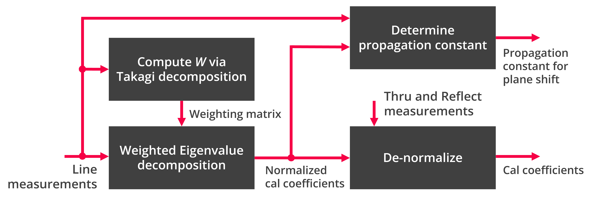
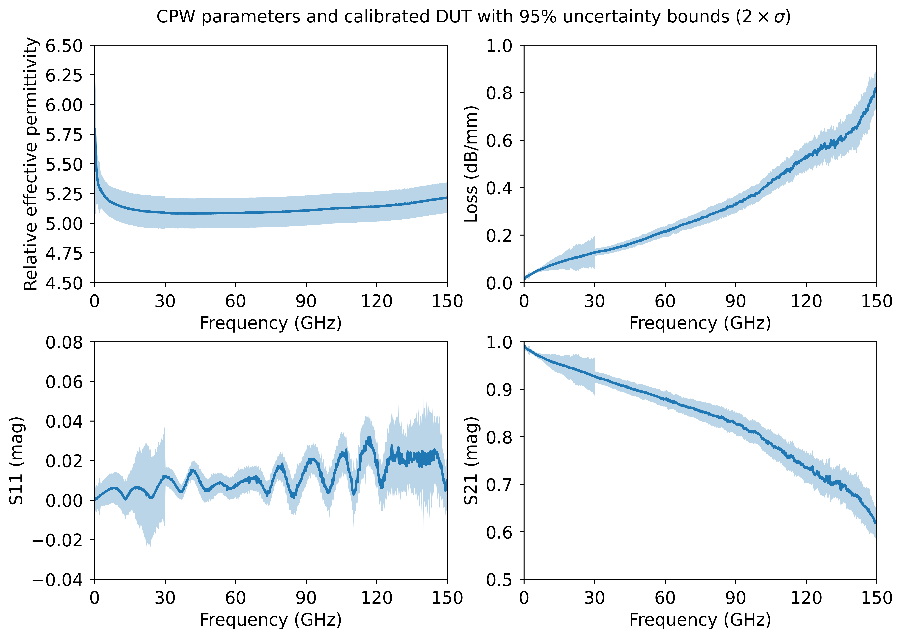
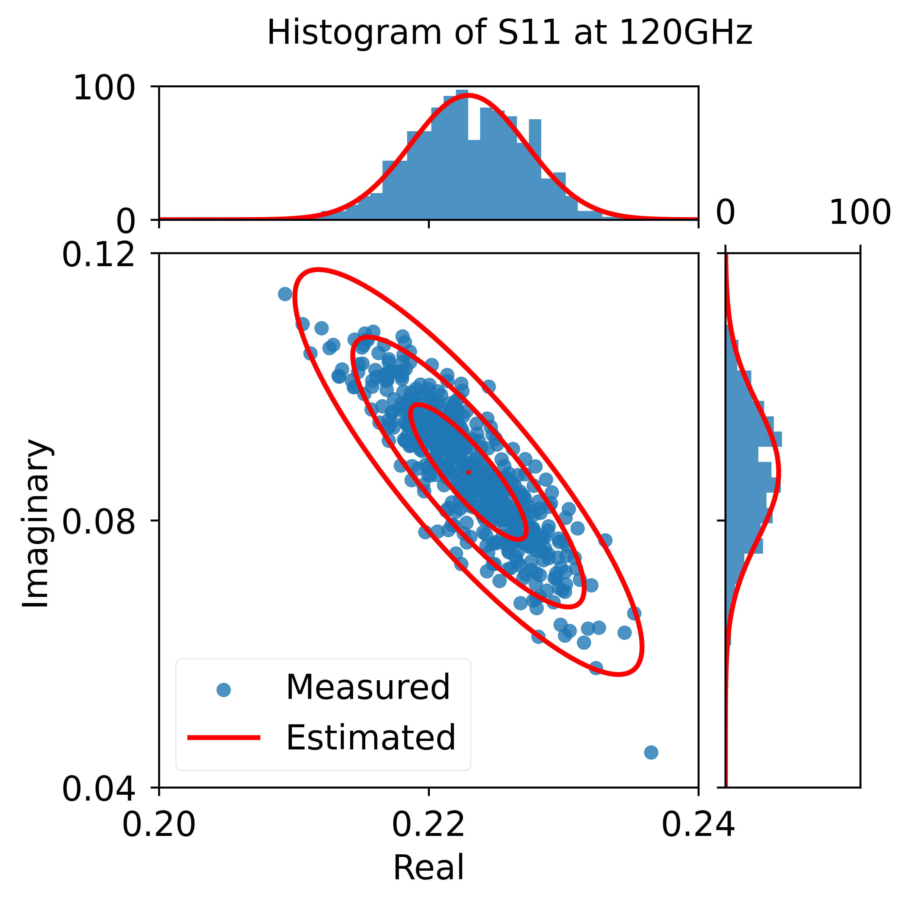
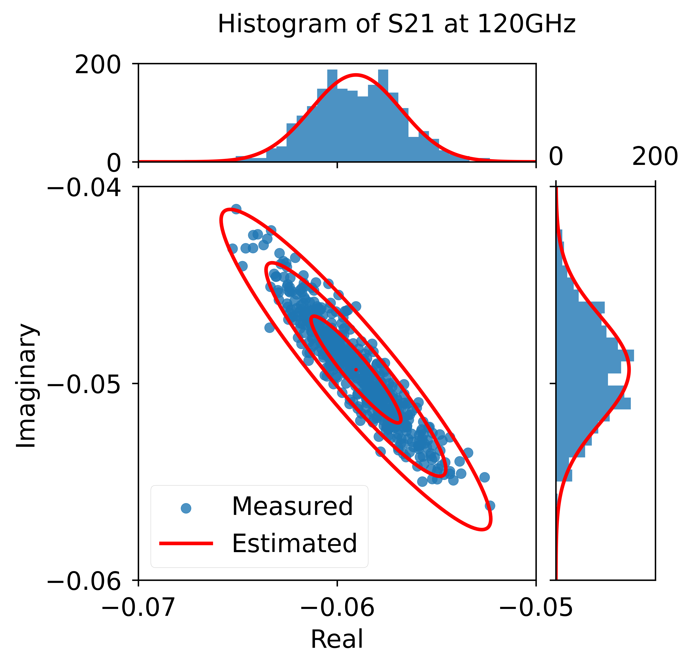
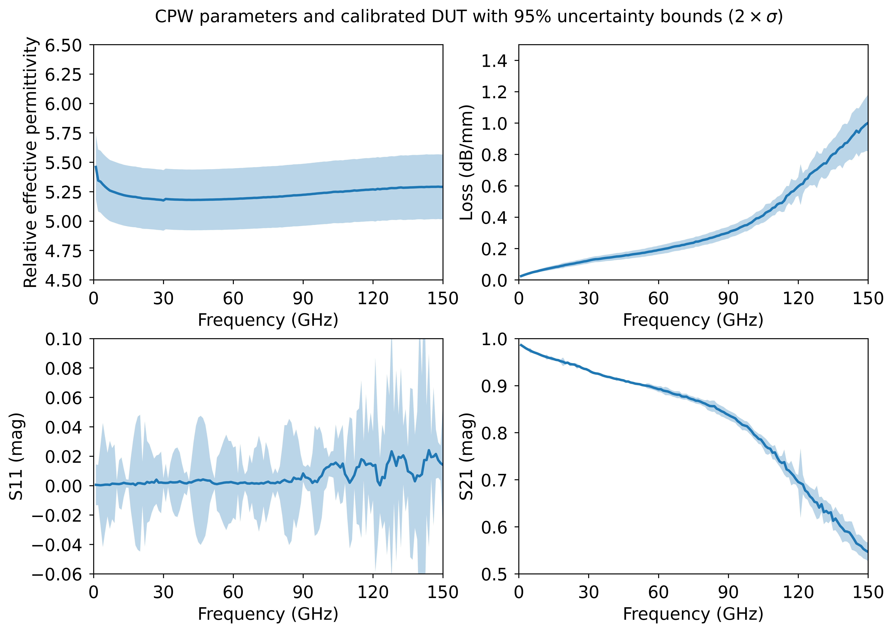
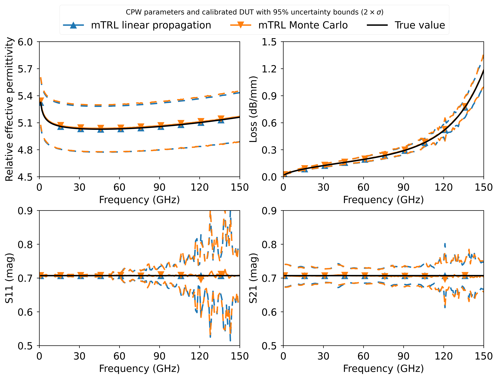
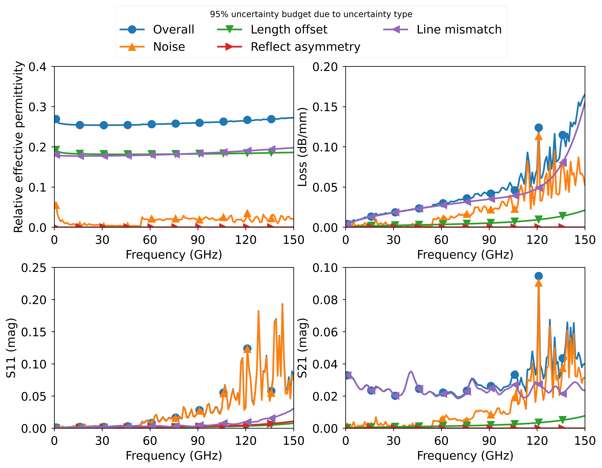
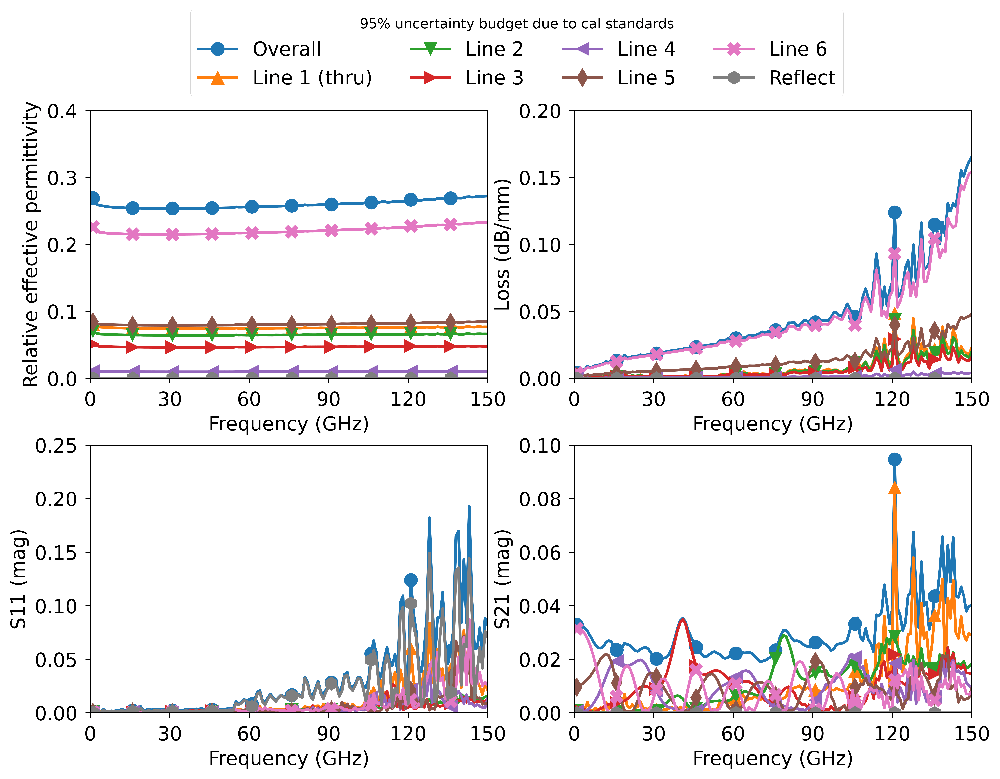

# Uncertainty Multiline TRL Calibration

A multiline thru-reflect-line (TRL) calibration inclusive linear uncertainty propagation.

## About the implementation

This extension of my original mTRL algorithm [1] includes linear uncertainty capabilities. I used Automatic differentiation (AD) with help of the package METAS UncLib [2] to compute derivatives (Jacobian). All uncertainties are defined as frequency-dependent covariance matrices. In current implementation, the following uncertainties can be propagated:

* S-parameter measurement noise.
* Line length uncertainty.
* Reflect asymmetry.
* Line mismatch.

If you're interested in how I approached the problem, you can read a summary of the work in [3], or an in-depth details in [4].

In comparison to my previous work [1], I simplified the mTRL implementation to easily propagate uncertainties. In [1], I used an optimization procedure to compute the propagation constant, which was then used to compute the weighting matrix *W*. In this current implementation, the propagation constant is not directly part of the calibration solution. Instead, the weighting matrix is computed directly using Takagi decomposition from line measurements. However, an estimate of the propagation constant is still needed to resolve sign ambiguity. The estimate of the propagation constant is determined after solving the eigenvalue problem, which can be used later, for example, to shift the reference plane. A summary flow diagram is depicted below. In each step, the input uncertainties (covariance) are propagated through each step.


*mTRL calibration forward flow diagram.*

## Code requirements

You need to have the following packages installed in your python environment:

```powershell
python -m pip install -U numpy scikit-rf metas_unclib matplotlib
```

Of course, you need to load the file `umTRL.py` into your main script (see the examples).

In case you get an error about `pythonnet` while installing `metas_unclib`, try first installing the [pre-release](https://stackoverflow.com/questions/67418533/how-to-fix-error-during-pythonnet-installation) of `pythonnet`:

```python
python -m pip install --pre pythonnet
```

## How to use

Here is a simple pseudo-code on how it works. If you use the uncertainty mode, all data will be in METAS uncertainty type (except for calibrated network, those are provided as a skrf type). Other auxiliary functions, as shifting reference plane, renormalize reference impedance, and 12-term conversion are the same as in my other [repo](https://github.com/ZiadHatab/multiline-trl-calibration).

```python
import skrf as rf
import numpy as np
import metas_unclib as munc
munc.use_linprop()

# my code
from umTRL import umTRL

# Measured calibration standards (in same folder)
L1    = rf.Network('measured_line_1.s2p')
L2    = rf.Network('measured_line_2.s2p')
L3    = rf.Network('measured_line_3.s2p')
L4    = rf.Network('measured_line_4.s2p')
SHORT = rf.Network('measured_short.s2p')

lines = [L1, L2, L3, L4]
line_lengths = [0, 1e-3, 3e-3, 5e-3]  # in units of meters
reflect = SHORT
reflect_est = -1
reflect_offset = 0

# uncertainties (simple case of providing variances)
# S-parameters measurement uncertainties 
sigma     = 0.002 # iid Gaussian noise
uSlines   = sigma**2 # measured lines
uSreflect = sigma**2 # measured reflect 

ulengths  = (0.02e-3)**2  # uncertainty in length
ureflect  = np.diag([0.01, 0])**2  # uncertainty in the reflect standard (real and imag)

# mismatch uncertainty 
# for this to make sense, check the examples, and also read about in [4]
uereff_Gamma = np.diag([0.05, 0.5e-4, 0.002, 1.5e-7])**2 

# define the calibration
cal = umTRL(lines=lines, line_lengths=line_lengths, reflect=reflect, 
               reflect_est=reflect_est, reflect_offset=reflect_offset, 
               ereff_est=ereff_est, switch_term=None,
               uSlines=uSlines, ulengths=ulengths, uSreflect=uSreflect, 
               ureflect=ureflect, uereff_Gamma=uereff_Gamma,
               )

cal.run_umTRL()   # run mTRL with uncertainty evaluation
# cal.run_mTRL()    # this runs mTRL without uncertainties. Very fast, as METAS package is not used.

dut = rf.Network('measured_dut.s2p') # in same folder
cal_dut, cal_dut_S_metas = cal.apply_cal(dut)  # apply cal to a dut and return also S-parameters in METAS datatype.

# propagation constant and effective relative dielectric constant (in METAS datatype)
gamma = cal.gamma
ereff = cal.ereff

# NOTE: you can extract the uncertainties directly from METAS datatype, check their Python API:
# https://www.metas.ch/metas/en/home/fabe/hochfrequenz/unclib.html
```

## Defining Covariance Matrices

You may have noticed that I don't fully define a covariance matrix in the examples. This is because, in most cases, you don't need to fully define a covariance matrix. However, I understand that this may cause confusion for some people. Therefore, I will demonstrate how to define the most general and the most simple cases of covariance matrices for mTRL calibration.

Before I discuss how to write covariance matrices for mTRL calibration, here are a few basics you should be aware of when dealing with covariance matrices:

* The covariance of a real scalar is simply the variance (scalar).
* The covariance of a complex scalar is a 2x2 matrix. The first entry is for the real part, and the second entry is for the imaginary part (if it's already known in polar coordinates, you need to transform it to cartesian coordinates).
* The covariance of a *NxM* real matrix is a *(NM)x(NM)* matrix. To be honest, covariance is defined for vectors. The way people generalized it to matrices is by computing the covariance of the vectorized version of the matrix using the [vec() operator](https://en.wikipedia.org/wiki/Vectorization_%28mathematics%29), which creates a vector from the matrix by stacking its columns. That's why the covariance has a dimension of *(NM)x(NM)*.
* The covariance of a *NxM* complex matrix is a *(2NM)x(2NM)* matrix. This is because we have two matrices, one for the real part and the second for the imaginary part. Remember, the order is real then imaginary for each element.
* If the elements in a matrix (or vector) are independent, then the corresponding covariance matrix is a diagonal matrix. The diagonal elements are the variances of the elements.

### Frequency-dependent covariance

This is the most general case, where you know the covariance at each frequency point. However, we assume independency between the frequency points. For example, if we have *K* frequency points of 2-port S-parameters measurement. The resulting covariance would be a 3D array of the size: *Kx8x8.* Essentially, we have a 8x8 covariance matrix at each frequency point.

```python
covS = np.array([ [[cov1]], [[cov2]], ...,  [[covK]] ])
```

### Frequency-independent covariance

In some cases, the covariance is the same at every frequency point. One way to define the total covariance is to repeat a single covariance matrix *K* times, where *K* is the number of frequency points:

```python
Cov = np.tile(cov, reps=(K,1,1))
```

Alternatively, you can use my mTRL code and pass a single covariance matrix. The code will automatically repeat it along the frequency:

```python
Cov = cov  # where cov is a single covariance matrix of a set of parameters, e.g., S-parameters or lengths.
```

### Correlation-free covariance

In some cases, the covariance matrix describes independent elements, i.e., it is a diagonal matrix. In such cases, you can write the diagonal matrix directly:

```python
cov = np.diag([var1, var2, ..., varN])
```

Alternatively, you can pass a vector of variances directly. The code will automatically diagonalize it to a covariance matrix:

```python
cov = np.array([var1, var2, ..., varN])
```

### Equal-variance covariance

The most simple case, which I use often, is when you assume all parameters have the same variance and are independent. In this case, the covariance matrix is a variance value multiplied by an identity matrix.

```python
cov = var*np.eye(N)
```

You can also pass a scalar as the covariance. The code will automatically expand it to a diagonal matrix. I often use this to assign uncertainty in the length of the lines.

```python
cov = var
```

### Limitations

If your covariance matrix varies with frequency, you must define it manually as in the first general case. Even if it is only constructed from variances, you need to explicitly define the covariance matrix at each frequency point. The simplification cases mentioned earlier are meant to be used when you have frequency-independent covariance or variance.

## To-Do List

This project is ongoing and will be continuously updated. Currently, there are a few planned updates:

* The code currently only handles one reflect standard. I intend to update it later to handle multiple reflect standards, as the code is becoming complex.
* I plan to include probing and repeatability uncertainties in the future. The details are still being worked out.
* I plan to eventually rewrite the code to eliminate its dependency on the METAS uncLib package. I might consider using numerical Jacobian methods. I will see what is most appropriate method without loss of accuracy.

## Examples

### example 1 — calibration on MPI cal substrate

The data in this example is quite old, but it demonstrates how to generally apply the calibration with switch terms and propagate uncertainties. The uncertainties provided in this example are not the actual uncertainties of the calibration standards or the VNA. They are just arbitrary numbers I came up with to show how the code works. Also, be carful when interpreting the uncertainties of magnitude values around zero. The linear propagation approach can be misleading, as these uncertainties do not follow Gaussian.


*Relative effective permittivity and loss, as well as S11 and S21 of calibrated DUT (line standard) with 95% uncertainty coverage.*

### example 2 — calibration on FF cal substrate

The data I used here is more recent and was also used in [4]. The measurements were taken across multiple frequency sweeps, allowing me to estimate the covariance of noise from the VNA for each standard (see histograms below as an example). The uncertainties in the CPW structures were estimated using a CPW model (see `cpw.py`).

  |  
:-------------------------:|:-------------------------:


*Relative effective permittivity and loss, as well as S11 and S21 of calibrated DUT (line standard) with 95% uncertainty coverage.*

### example 3 — linear uncertainty vs. Monte Carlo

The most effective way to validate the linear uncertainty propagation method is by comparing it to the full Monte Carlo method. To simulate random variations in the calibration standards, I used the error-boxes from the measurements and generated CPW calibration standards with the cpw model (see `cpw.py`), which are embedded within the error-boxes. The DUT used in this example is a dummy device with equal reflection and transmission, to observe the effects of calibration on both S11 and S21 equally.


*Comparison between linear uncertainty propagation and Monte Carlo analysis (100 trials). The uncertainty bounds correspond to 95% coverage.*

This example also includes a breakdown of the uncertainty budget based on the type of uncertainty and the individual standards.


*95% uncertainty budget with respect to uncertainty types.*


*95% uncertainty budget with respect to calibration standards.*

## Crediting

If you found this tool useful and used it in a publication, please consider citing reference [4]. You can also cite [3] as well, but citing [4] is sufficient.

## References

* [1] Z. Hatab, M. Gadringer and W. Bösch, "Improving The Reliability of The Multiline TRL Calibration Algorithm," 2022 98th ARFTG Microwave Measurement Conference (ARFTG), 2022, pp. 1-5, doi: [10.1109/ARFTG52954.2022.9844064](http://dx.doi.org/10.1109/ARFTG52954.2022.9844064).

* [2] M. Zeier, J. Hoffmann, and M. Wollensack, “Metas.unclib–a measurement uncertainty calculator for advanced problems,” Metrologia, vol. 49, no. 6, pp. 809–815, nov 2012, doi: [10.1088/0026-1394/49/6/809](http://dx.doi.org/10.1088/0026-1394/49/6/809). METAS website: [https://www.metas.ch/metas/en/home/fabe/hochfrequenz/unclib.html](https://www.metas.ch/metas/en/home/fabe/hochfrequenz/unclib.html)

* [3] Z. Hatab, M. Gadringer, and W. Bösch, "Propagation of Measurement and Model Uncertainties through Multiline TRL Calibration," 2022 Conference on Precision Electromagnetic Measurements (CPEM), Wellington, New Zealand, 2022, pp. 1-2, , doi: *I will update when available*. e-print: [https://arxiv.org/abs/2206.10209](https://arxiv.org/abs/2206.10209)

* [4] Z. Hatab, M. Gadringer, and W. Bösch, "Propagation of Linear Uncertainties through Multiline Thru-Reflect-Line Calibration," e-print: *I will update this soon*

## About the license

The code in this repository is licensed under the BSD-3-Clause license. However, in order to use it, you also need to install the METAS UncLib package, which has its own separate license. [https://www.metas.ch/metas/en/home/fabe/hochfrequenz/unclib.html](https://www.metas.ch/metas/en/home/fabe/hochfrequenz/unclib.html)

