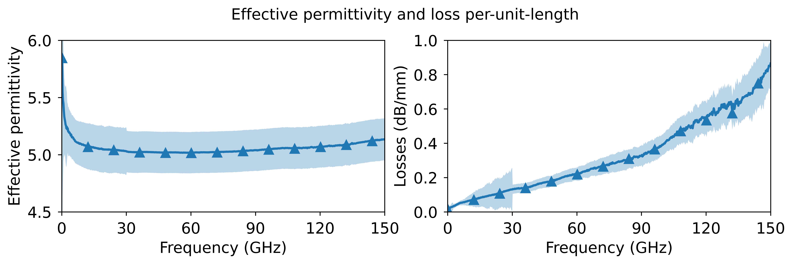

# Uncertainty Multiline TRL Calibration
A multiline thru-reflect-line (TRL) calibration inclusive linear uncertainty propagation capabilities.

## About the implementation

This is an extension of my original [mTRL algorithm](https://github.com/ZiadHatab/multiline-trl-calibration) [1]. I integrated METAS UncLib [2] package in my code so I don’t need to derive the Jacobians myself. I included additional math to cope with different uncertainty types and for everything to work cohesively. 

All uncertainties are defined as covariance matrices as function of frequency. If only one covariance matrix is given, the code will repeat it along the frequency. If only a scalar variance is given, then a diagonal covariance matrix is generated and repeated along the frequency. 

## Code requirements

You need to have the following packages installed in your python environment:

```powershell
python -m pip install -U numpy scipy scikit-rf metas_unclib matplotlib
```

Of course, you need to load the file `umTRL.py` into your main script (see the examples).

## How to use

Here is a simple pseudo-code on how it will work. If you use the uncertainty mode, all data will be in METAS uncertainty type (except for calibrated network, those are provided as a skrf type). The functions to shift reference plane and impedance renormalization is the same as in my other [repo](https://github.com/ZiadHatab/multiline-trl-calibration).

```python
import skrf as rf
import numpy as np
import metas_unclib as munc
munc.use_linprop()

# my code
from umTRL import umTRL

# Measured calibration standards
L1    = rf.Network('measured_line_1.s2p')
L2    = rf.Network('measured_line_2.s2p')
L3    = rf.Network('measured_line_3.s2p')
L4    = rf.Network('measured_line_4.s2p')
SHORT = rf.Network('measured_short.s2p')

lines = [L1, L2, L3, L4]
line_lengths = [0, 1e-3, 3e-3, 5e-3]  # in units of meters
reflect = SHORT
reflect_est = -1
reflect_offset = 0

# uncertainties (simple case of providing variances)
# S-parameters measurement uncertainties 
sigma     = 0.002 # iid AWGN
uSlines   = sigma**2 # measured lines
uSreflect = sigma**2 # measured reflect 

ulengths  = (0.02e-3)**2  # uncertainty in length
ureflect  = np.array([0.01, 0])**2  # uncertainty in the reflect standard

# mismatch uncertainty (check example 2 or 3)
uereff_Gamma = np.array([0.05, 0.5e-4, 0.002, 1.5e-7])**2 

# define the calibration
cal = umTRL(lines=lines, line_lengths=line_lengths, reflect=reflect, 
               reflect_est=reflect_est, reflect_offset=reflect_offset, 
               ereff_est=ereff_est, switch_term=None,
               uSlines=uSlines, ulengths=ulengths, uSreflect=uSreflect, 
               ureflect=ureflect, uereff_Gamma=uereff_Gamma,
               )

cal.run_umTRL()      # run mTRL with uncertainty evaluation
# cal.run_mTRL()  # this runs mTRL without uncertainties. Very fast, as METAS package not used.

dut = rf.Network('measured_dut.s2p')
cal_dut, cov = cal.apply_cal(dut)  # apply cal to a dut. 

# propagation constant and effective constant
gamma = cal.gamma
ereff = cal.ereff

```

## TO-DO

This is ongoing work and it will continuously get updated. For now, there are a few things I planned:

- The code at the moment takes only one reflect standard. To be honest, I intentionally want it to handle only one reflect standard, as the code is starting to get messy. I will update the code later to take multiple reflect standards.
- I want to include a function that takes wave quantities (a and b waves) and convert them to S-parameters with their covariance matrix. This is actually not difficult to implement. My biggest issue is that every VNA instrument gives you the wave quantities as csv file, and they all use different format. Maybe someone knows a standardized way to handle wave quantities?
- I will try to include connecter, probing and repeatability uncertainties. I’m not sure exactly about the details, but I will figure that out. At the moment the code can handle the following uncertainties: measurement, length, reflect and mismatch uncertainties.
- I said this in my other [repo](https://github.com/ZiadHatab/multiline-trl-calibration), I will also try here to include a proper documentation for this code (I’m bad at time management, so don’t expect it any time soon). For now, if anyone has a question, just ask me directly here or write me at zi.hatab@gmail.com (or z.hatab@tugraz.at).

## Examples

### example 1 — on-wafer ISS calibration

This example shows you how to perform 1st-tier mTRL calibration with uncertainty treatment. The variances that I have given in this example are not the actual uncertainties of the calibration standards nor the VNA. I just roughly estimated some numbers to showcase how the code works. 




### example 2 — linear uncertainty (LU) vs. Monte Carlo (MC)

According to GUM (Guide to the Expression of Uncertainty in Measurement), the best way to verify the validity of linear uncertainty propagation is by comparing it against full Monte Carlo method. So, to mimic a scenario where there are randomness in the calibration standards, I opted for simulated data, where I can control everything about the standards. In below images I considered all uncertainties (except switch terms), and MC was done for 100 trials (it gets better if you increase the trials, and slower!). 


### example 3 — contribution of each uncertainty type

This is basically a breakdown of the previous example, where I show the contribution of each input uncertainty in the output uncertainty.


## References

- [1] Z. Hatab, M. Gadringer, and W. Bosch, "Improving the reliability of the multiline trl calibration algorithm," in 98th ARFTG Microwave Measurement Conference, Las Vegas, NV, USA, 2022.
    
    
- [2] M. Zeier, J. Hoffmann, and M. Wollensack, "Metas.UncLib—a measurement uncertainty calculator for advanced problems," Metrologia, vol. 49, no. 6, pp. 809–815, nov 2012. [https://www.metas.ch/metas/en/home/fabe/hochfrequenz/unclib.html](https://www.metas.ch/metas/en/home/fabe/hochfrequenz/unclib.html)
    

## About the license

All written code in this repo is mine and are under the BSD-3-Clause license. However, to be able to actually use my code you need to install METAS UncLib package, which is under their own license [https://www.metas.ch/metas/en/home/fabe/hochfrequenz/unclib.html](https://www.metas.ch/metas/en/home/fabe/hochfrequenz/unclib.html).

Other packages as numpy, skrf, scipy and matplotlib are either under MIT or BSD-3. So nothing to be concerned there.
