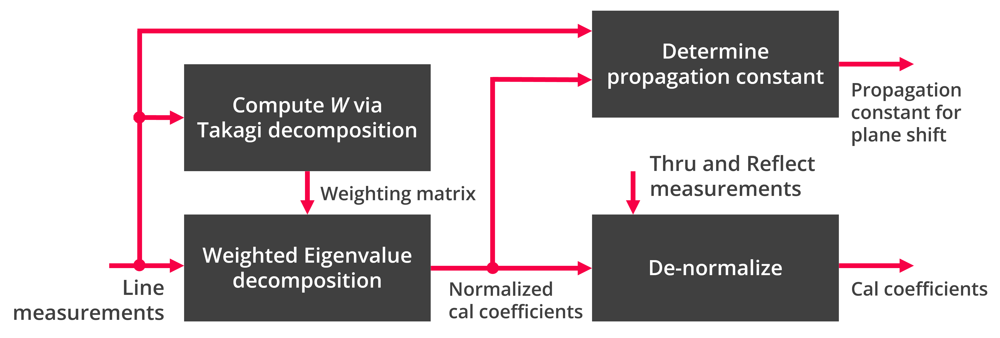
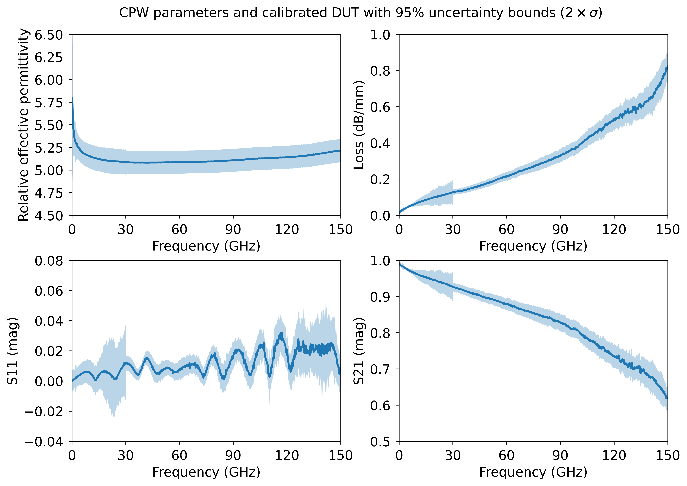
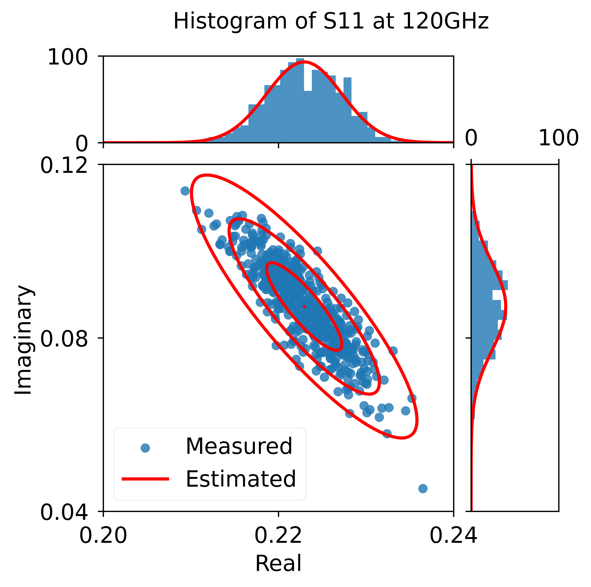
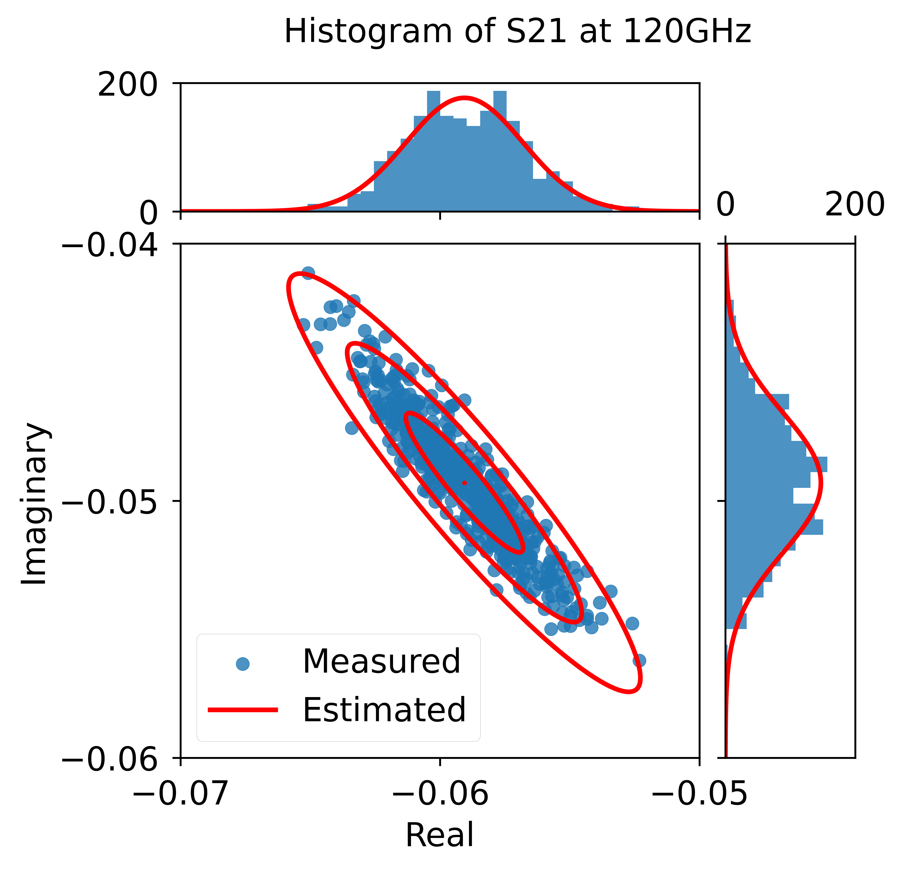
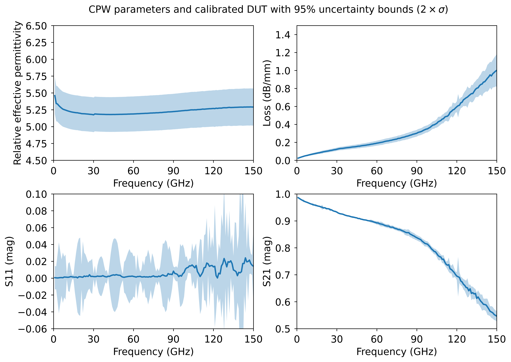
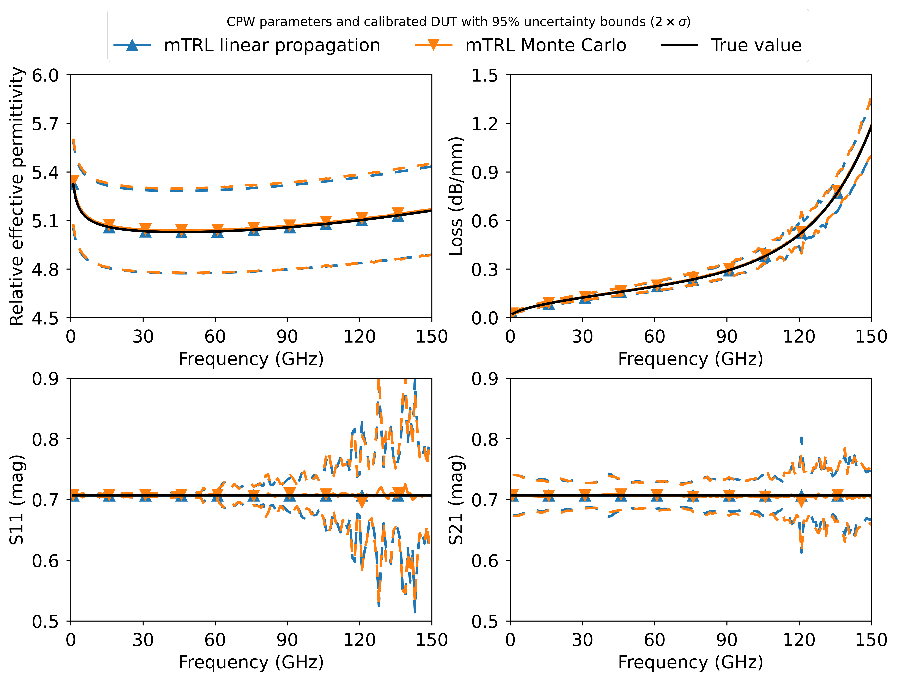
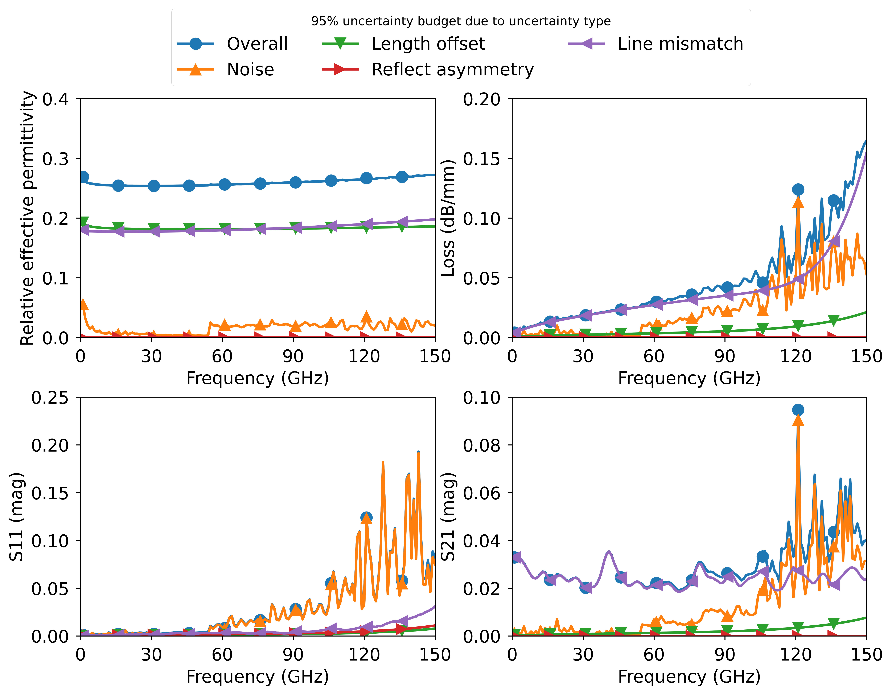
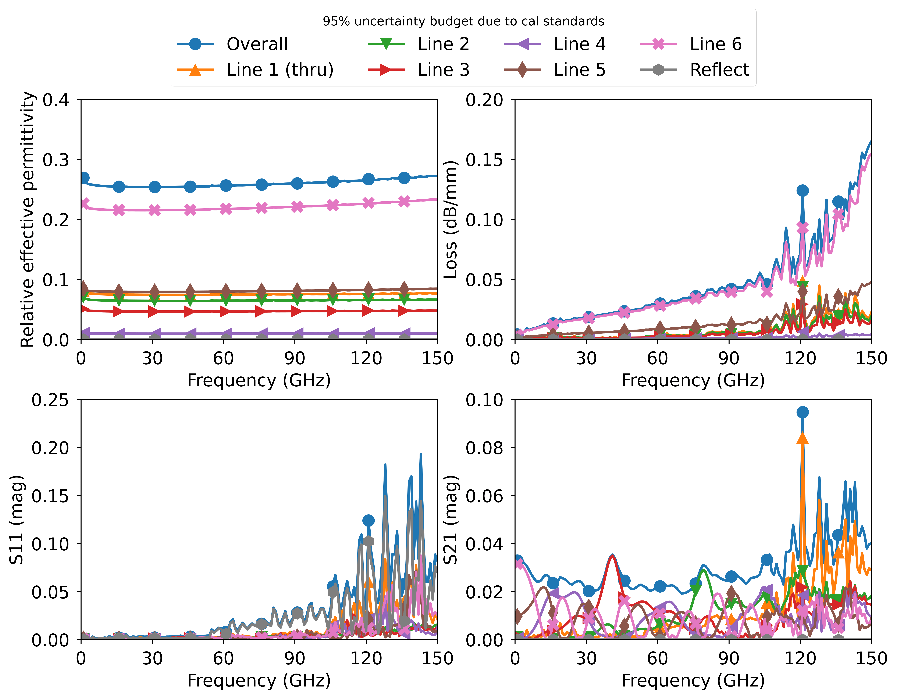

# Uncertainty Multiline TRL Calibration

Multiline thru-reflect-line (TRL) calibration with linear uncertainty propagation.

## About

This extends my original mTRL algorithm [1] with linear uncertainty support. Derivatives (Jacobians) are computed via automatic differentiation (AD) using the METAS UncLib package [2]. All uncertainties are expressed as frequency-dependent covariance matrices. The following uncertainty sources can be propagated:

* S-parameter measurement noise
* Line length uncertainty
* Reflect asymmetry
* Line mismatch

For details, see the summary in [3] or the full treatment in [4].

Compared to [1], the implementation is simplified to facilitate uncertainty propagation. The weighting matrix *W* is now computed directly via Takagi decomposition of the line measurements, rather than through an optimization of the propagation constant. An estimate of the propagation constant is still derived after solving the eigenvalue problem (e.g., for reference plane shifts), but it is no longer part of the core calibration solution. The flow diagram below illustrates each step, through which input covariances are propagated.


*mTRL calibration forward flow diagram.*

## Requirements

Install the required packages:

```powershell
python -m pip install -U numpy scikit-rf metas_unclib matplotlib
```

You also need to load `umTRL.py` into your main script (see the examples).

If you encounter a `pythonnet` error when installing `metas_unclib`, first install the [pre-release version](https://stackoverflow.com/questions/67418533/how-to-fix-error-during-pythonnet-installation):

```powershell
python -m pip install --pre pythonnet
```

## How to use

Below is a minimal pseudo-code example. In uncertainty mode, all outputs are in the METAS uncertainty type, except for the calibrated network which is returned as a `skrf` type. Auxiliary functions (reference plane shift, impedance renormalization, 12-term conversion) are the same as in my other [repo](https://github.com/ZiadHatab/multiline-trl-calibration).

```python
import skrf as rf
import numpy as np
import metas_unclib as munc
munc.use_linprop()

# my code
from umTRL import umTRL

# Measured calibration standards (in same folder)
L1    = rf.Network('measured_line_1.s2p')
L2    = rf.Network('measured_line_2.s2p')
L3    = rf.Network('measured_line_3.s2p')
L4    = rf.Network('measured_line_4.s2p')
SHORT = rf.Network('measured_short.s2p')

lines = [L1, L2, L3, L4]
line_lengths = [0, 1e-3, 3e-3, 5e-3]  # in units of meters
reflect = SHORT
reflect_est = -1
reflect_offset = 0

# uncertainties (simple case of providing variances)
# S-parameters measurement uncertainties 
sigma     = 0.002 # iid Gaussian noise
uSlines   = sigma**2 # measured lines
uSreflect = sigma**2 # measured reflect 

ulengths  = (0.02e-3)**2  # uncertainty in length
ureflect  = np.diag([0.01, 0])**2  # uncertainty in the reflect standard (real and imag)

# mismatch uncertainty 
# for this to make sense, check the examples, and also read about in [4]
uereff_Gamma = np.diag([0.05, 0.5e-4, 0.002, 1.5e-7])**2 

# define the calibration
cal = umTRL(lines=lines, line_lengths=line_lengths, reflect=reflect, 
               reflect_est=reflect_est, reflect_offset=reflect_offset, 
               ereff_est=ereff_est, switch_term=None,
               uSlines=uSlines, ulengths=ulengths, uSreflect=uSreflect, 
               ureflect=ureflect, uereff_Gamma=uereff_Gamma,
               )

cal.run_umTRL()   # run mTRL with uncertainty evaluation
# cal.run_mTRL()    # this runs mTRL without uncertainties. Very fast, as METAS package is not used.

dut = rf.Network('measured_dut.s2p') # in same folder
cal_dut, cal_dut_S_metas = cal.apply_cal(dut)  # apply cal to a dut and return also S-parameters in METAS datatype.

# propagation constant and effective relative dielectric constant (in METAS datatype)
gamma = cal.gamma
ereff = cal.ereff

# NOTE: you can extract the uncertainties directly from METAS datatype, check their Python API:
# https://www.metas.ch/metas/en/home/fabe/hochfrequenz/unclib.html
```

## Defining Covariance Matrices

The examples don't always define a full covariance matrix, since it's often unnecessary. Below are the supported cases, from most general to simplest.

A few basics to keep in mind:

* The covariance of a real scalar is its variance (a scalar).
* The covariance of a complex scalar is a 2x2 matrix (real part, then imaginary part). If given in polar form, convert to Cartesian first.
* The covariance of an *NxM* real matrix is an *(NM)x(NM)* matrix, computed from the vectorized (column-stacked) form via the [vec() operator](https://en.wikipedia.org/wiki/Vectorization_%28mathematics%29).
* The covariance of an *NxM* complex matrix is a *(2NM)x(2NM)* matrix (real block first, then imaginary).
* If all elements are independent, the covariance matrix is diagonal, with variances on the diagonal.

### Frequency-dependent covariance

The most general case: a unique covariance matrix at each frequency point (with independence assumed across frequencies). For *K* frequency points of 2-port S-parameters, the covariance is a *Kx8x8* array:

```python
covS = np.array([ [[cov1]], [[cov2]], ...,  [[covK]] ])
```

### Frequency-independent covariance

When the covariance is constant across frequency, you can either tile it manually:

```python
Cov = np.tile(cov, reps=(K,1,1))
```

Or pass a single matrix directly and the code will broadcast it across all frequencies:

```python
Cov = cov  # where cov is a single covariance matrix of a set of parameters, e.g., S-parameters or lengths.
```

### Diagonal covariance

For independent elements, provide the diagonal directly:

```python
cov = np.diag([var1, var2, ..., varN])
```

### Scalar covariance

The simplest case: equal variance and independence across all elements. Pass a scalar and the code expands it to a scaled identity matrix:

```python
cov = var
```

### Limitations

Frequency-varying covariance must be defined explicitly as a 3D array (the first general case). The shorthand forms above apply only when the covariance is frequency-independent.

## To-Do List

This project is ongoing. Planned updates include:

* Support for multiple reflect standards.
* Probing and repeatability uncertainties.
* Rewrite to remove the METAS UncLib dependency to more license friendly package (e.g., [GTC](https://github.com/MSLNZ/GTC), [AutoUncertainties](https://github.com/varchasgopalaswamy/AutoUncertainties), [uncertainties](https://github.com/lmfit/uncertainties), ..., etc).

## Examples

### Example 1 — calibration on MPI cal substrate

This example demonstrates calibration with switch terms and uncertainty propagation. Note: the uncertainties used are illustrative only, not actual values for the standards or VNA. Be cautious interpreting uncertainties of magnitude values near zero, as linear propagation can be misleading for non-Gaussian distributions.


*Relative effective permittivity and loss, as well as S11 and S21 of calibrated DUT (line standard) with 95% uncertainty coverage.*

### Example 2 — calibration on FF cal substrate

This example uses more recent data, also used in [4]. Measurements were taken across multiple frequency sweeps to estimate the VNA noise covariance per standard (see histograms below). Uncertainties in the CPW structures were estimated using a CPW model (see `cpw.py`).

  |  
:-------------------------:|:-------------------------:


*Relative effective permittivity and loss, as well as S11 and S21 of calibrated DUT (line standard) with 95% uncertainty coverage.*

### Example 3 — linear uncertainty vs. Monte Carlo

This example validates the linear uncertainty method against full Monte Carlo simulation. Random variations in calibration standards are simulated using error-boxes from measurements with CPW standards generated by the CPW model (see `cpw.py`). The DUT is a dummy device with equal reflection and transmission, to observe calibration effects on both S11 and S21.


*Comparison between linear uncertainty propagation and Monte Carlo analysis (100 trials). The uncertainty bounds correspond to 95% coverage.*

This example also includes a breakdown of the uncertainty budget based on the type of uncertainty and the individual standards.


*95% uncertainty budget with respect to uncertainty types.*


*95% uncertainty budget with respect to calibration standards.*

## Crediting

If you found this useful and used it in a publication, please cite [1] and[4]. If you use the measurements, please also cite [5].

## References

[1] Z. Hatab, M. Gadringer and W. Bösch, "Improving The Reliability of The Multiline TRL Calibration Algorithm," 2022 98th ARFTG Microwave Measurement Conference (ARFTG), 2022, pp. 1-5, doi: [10.1109/ARFTG52954.2022.9844064](http://dx.doi.org/10.1109/ARFTG52954.2022.9844064).

[2] M. Zeier, J. Hoffmann, and M. Wollensack, “Metas.unclib–a measurement uncertainty calculator for advanced problems,” Metrologia, vol. 49, no. 6, pp. 809–815, nov 2012, doi: [10.1088/0026-1394/49/6/809](http://dx.doi.org/10.1088/0026-1394/49/6/809). METAS website: [https://www.metas.ch/metas/en/home/fabe/hochfrequenz/unclib.html](https://www.metas.ch/metas/en/home/fabe/hochfrequenz/unclib.html)

[3] Z. Hatab, M. Gadringer, and W. Bösch, "Propagation of Measurement and Model Uncertainties through Multiline TRL Calibration," 2022 Conference on Precision Electromagnetic Measurements (CPEM), Wellington, New Zealand, 2022, pp. 1-2, , doi: *I will update when available*. e-print: [https://arxiv.org/abs/2206.10209](https://arxiv.org/abs/2206.10209)

[4] Z. Hatab, M. E. Gadringer, and W. Bösch, "Propagation of Linear Uncertainties through Multiline Thru-Reflect-Line Calibration," in _IEEE Transactions on Instrumentation and Measurement_, vol. 72, pp. 1-9, 2023, doi: [10.1109/TIM.2023.3296123](http://dx.doi.org/10.1109/TIM.2023.3296123).

[5] Z. Hatab, "Linear Uncertainty Propagation in Multiline TRL Calibration: Dataset and Code". Graz University of Technology, Jan. 22, 2023. doi: [10.3217/gvzyw-1ea97](http://dx.doi.org/10.3217/gvzyw-1ea97)

## License

The code is licensed under the BSD-3-Clause license. Note that the METAS UncLib package, which is required to run the uncertainty features, has its own separate license: [https://www.metas.ch/metas/en/home/fabe/hochfrequenz/unclib.html](https://www.metas.ch/metas/en/home/fabe/hochfrequenz/unclib.html)